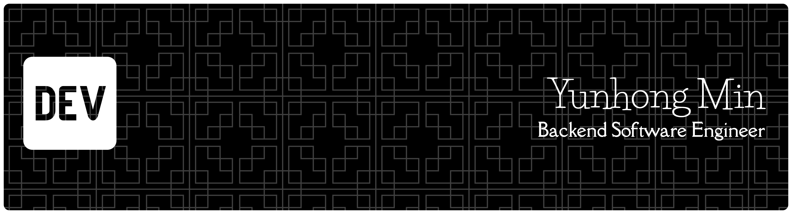

# About Me
- I am a Backend Software Engineer with about 10 years of experience.
- I also have experience in DevOps engineering.

# Tech Stack

## Languages
  

## Backend Frameworks
      

## Databases & Messaging
        

## DevOps
       

## Frontend
    

## AI/ML
    

## Tools
      

# Projects
## [EasyLocAI](https://github.com/fidemin/easylocai)
> Fully autonomous agentic workflows running locally — no APIs, no data leaks.

A privacy-first, on-device AI agent that executes complex multi-step tasks using a **Plan → Execute → Replan** loop — powered by `gpt-oss:20b` via Ollama with zero cloud dependency.

- 🔒 **Privacy-first** — 100% local execution, data never leaves your machine
- 🔧 **MCP tool integration** — filesystem, terminal, Kubernetes, Notion, and more
- 🔄 **Adaptive orchestration** — autonomously pivots strategy based on real-time feedback